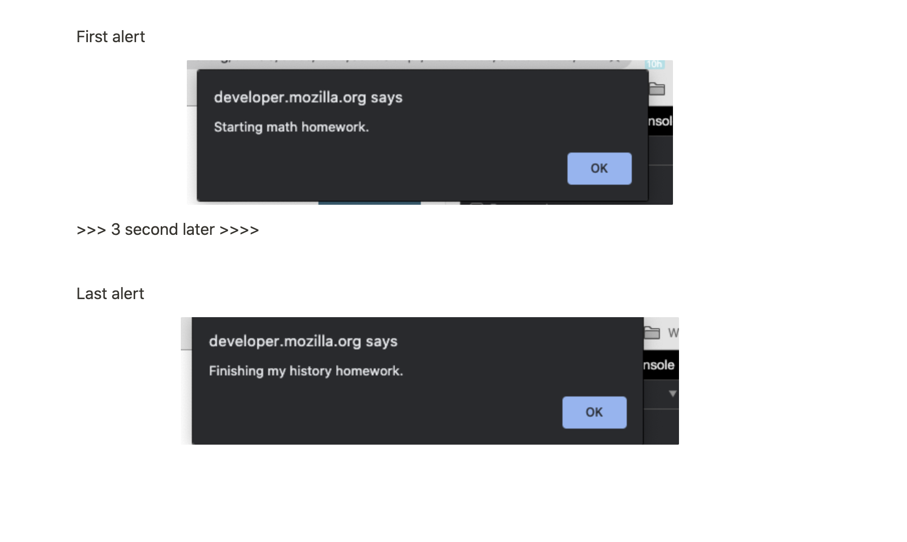

<br>

### Refactor Promise chain to await / async

흠 하긴 했는데 바로 아래는 별로 좋은 예시는 아닌것 같다 ㅋㅋ
그래도 배운점은

- setTimeOut (API call과 유사한) 것을 new Promise로 하고 그 앞에 await을 붙여줍니다
- setTimeout 을 포함한 doHomework 함수는 async을 붙여줍니다
- 이 함수는 결과적으로 ⇒ Promise를 return하며 Promise fullfill을 위해 resolve가 필요합니다
- .then 으로 다음 동작을 실행할 수 있습니다 (async / await임에도, 결국 Promis를 return 하므로 가능)

```js
// Promise 예시
let doHomework = (subject) => {
  return new Promise((resolve) => {
    setTimeout(resolve, 3000, alert(`Starting my ${subject} homework.`));
  });
};
function alertFinished(value) {
  alert(`Finished my ${value}`);
}
//doHomework("math", alertFinished);
doHomework("math").then(() => alertFinished("history"));

/////////

// async/await 예시
async function doHomework(sub) {
  let alertHomework = alert(`Starting my ${sub} homework.`);
  await new Promise((resolve) => setTimeout(resolve, 1000, alertHomework));
}
function alertFinished(value) {
  alert(`Finished my ${value}`);
}
//doHomework("math", alertFinished);
doHomework("math").then(() => alertFinished("history"));
```

---

이것이 BEST
MDN 에 요런게 있길래 연습삼아
https://developer.mozilla.org/en-US/docs/Web/JavaScript/Reference/Statements/async_function


I think this is best case handle the event, timeout functions a

```jsx
// timeout 3 seconds
function resolveAfter3Seconds() {
  return new Promise((resolve) => {
    setTimeout(() => {
      resolve("foo");
    }, 3000);
  });
}

// first Fn
function doHomework(sub) {
  alert(`Starting ${sub} homework.`);
}

// Final Fn want to fun after timeout
function finishHomework(sub) {
  alert(`Finishing my ${sub} homework.`);
}

// async Call three above functions asynchronous
async function asyncCall(firstFun, secondFun) {
  firstFun("math");
  await resolveAfter3Seconds();
  secondFun("history");
}

asyncCall(doHomework, finishHomework);
```


